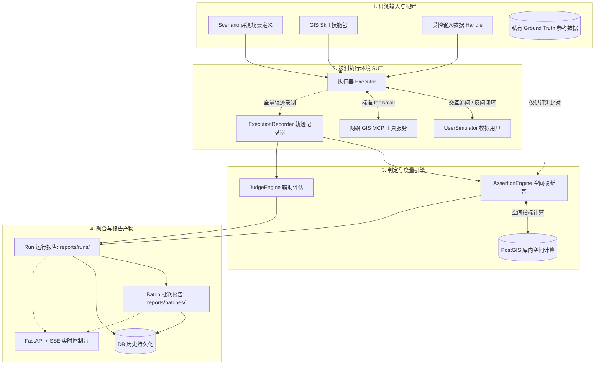

# GeoBenchMark (地理空间智能体与 Skill 自动化评测平台)

> **版本**：`v0.0.7` | **状态**：`WIP (Work In Progress)`
> 
> *注：本项目当前正处于持续迭代与完善中。*

GeoBenchMark 是一个专为 **地理空间智能体（GIS Agent）** 与 **GIS Skill 技能包** 打造的自动化基准评测平台。

平台致力于解决 GIS 领域 Agent 在长链路工具调用、空间逻辑决策、多轮人机反问交互中的**可信度、执行稳定性与空间准确性**评测难题。

---

## 1. 核心定位与设计原则

- **GIS 领域可信评测**：拒绝将不可靠的最终文本输出作为唯一依据，深度结合空间几何断言（库内 PostGIS 重叠率、面积误差、拓扑关系、CRS 校验）与确定性工具轨迹校验。
- **硬断言优先于主观 Judge**：能用客观空间分析与事实代码判断的内容，绝不交给大模型 Judge；LLM Judge 仅作为过程合理性与解释质量的辅助评分。
- **评测科学性与方差量化**：支持多场景批量运行（Batch）与单场景多次重复运行（Repeat），通过统计学指标（Pass Rate、耗时分布、工具覆盖率、香农轨迹多样性熵）量化 Agent 过程波动。
- **协议化与安全隔离**：全链路采用受控 Opaque Data Handle 与网络 MCP 协议，严防数据泄露、跨运行干扰与物理数据库表名穿透。

---

## 2. 评测执行流架构图



---

## 3. 核心功能特性

### 3.1 双模式执行器 (Executor Framework)
- **`skill`**：本地 Skill 引导模式，支持通过 LangGraph ReAct 驱动 Agent 遵循地理空间技能指引完成复杂任务。
- **`orchestrator`**：本地 Orchestrator 智能体多轮调度外部黑盒 Agent。

### 3.2 丰富的空间断言与可信基线
- **过程断言**（0 次数据库 / 0 次 LLM，纯轨迹确定性校验，读 ExecutionRecorder）：
  - `skill_loaded`：技能是否加载（`skill_id`）；
  - `tool_available`：工具是否可用（`tool`）；
  - `tool_called`：工具是否被调用（`tool`）；
  - `tool_sequence`：工具调用顺序，按序出现即可、不要求连续（`sequence: [a, b]`）；
  - `tool_argument_equals`：某工具某参数等于期望值（`tool, argument, value`）；
  - `result_dataset_exists`：结果数据集是否已登记（`alias`）；
  - `result_geometry_type_in`：结果几何类型是否符合预期（`target, values: [Polygon]`）；
  - `final_response_contains`：最终回答包含全部关键词（`values` / `value`）；
  - `skill_reference_loaded` / `skill_reference_not_loaded`：技能文档是否（未）按需读取（`path`）；
  - `skill_reference_loaded_before_tool`：先读文档再调某工具（`reference, tool`）；
  - `skill_reference_load_count_less_than`：文档加载次数上限（`value`）。
- **空间结果断言**（对真实几何做确定性比对，拒绝只信最终文字）：
  - `result_overlap_ratio`：空间几何重叠率（交集面积/参考面积）；
  - `result_area_error_max`：缓冲区/多边形面积相对误差；
  - `result_distance_max`：Hausdorff 空间偏移（米）；
  - `result_feature_count`：输出要素数量核对；
  - `result_fields_match`：结果字段与参考字段匹配（exact / contains）。
  - 文件后端（GeoPandas）与 PostGIS 库内后端双路径；断言项带 `actual` / `expected` / `backend`。

### 3.3 批量运行与方差标定 (Batch & Variance Metrics)
- 支持单场景 `repeat_count` 重复运行与多场景批量调度；
- 自动计算耗时分布（Mean/StdDev/P50/P90）、各工具使用频次与覆盖率；
- 计算**轨迹多样性熵（Trajectory Shannon Entropy）**，直观度量 Agent 决策分支的一致性与稳定性。

### 3.4 统一产物模型与控制面
- 独立产物落盘：
  - 单次运行：`reports/runs/<run_id>/result.json` & `report.md`；
  - 批次汇总：`reports/batches/<batch_id>/summary.json` & `summary.md`；
- 提供完整的 RESTful API 与 SSE 实时事件流，便于与 CI/CD 及 Web 控制台集成。

---

## 4. 快速开始

### 4.1 环境准备
平台基于 Python 3.10+ 构建。建议使用虚拟环境：

```bash
# 安装依赖
pip install -e . -i https://pypi.tuna.tsinghua.edu.cn/simple
```

### 4.2 启动后端服务

```bash
# 启动评测后端 API 服务 (FastAPI + Uvicorn)
uvicorn geoskillbench.api.app:app --host 0.0.0.0 --port 8000 --reload
```

服务启动后可访问：
- API 文档：`http://localhost:8000/docs`
- 健康检查：`http://localhost:8000/health`

### 4.3 启动前端可视化控制台

```bash
cd frontend
npm install
npm run dev
```
默认前端访问地址：`http://localhost:5173`。

---

## 5. CLI 命令行使用

平台提供开箱即用的命令行工具：

```bash
# 1. 校验评测场景配置是否合法
geoskillbench validate scenarios/buffer_school_500m_5b_001.yml

# 2. 列出场景所需与 MCP 服务提供的可用工具
geoskillbench list-tools scenarios/buffer_school_500m_5b_001.yml

# 3. 运行单个评测场景
geoskillbench run scenarios/buffer_school_500m_5b_001.yml --output reports

# 4. 执行全量自动化回归测试
pytest
```

---

## 6. 核心 API 概览

| 请求方法 | 路由 | 说明 |
|---|---|---|
| `GET` | `/api/scenarios` | 列出所有评测场景及元数据 |
| `POST` | `/api/tasks` | 创建单次场景评测任务（异步） |
| `GET` | `/api/tasks/{task_id}/events` | SSE 实时订阅单任务评测状态与日志流 |
| `POST` | `/api/batches` | 创建批量 / 重复评测批次任务 |
| `GET` | `/api/batches` | 获取批次历史列表与统计摘要 |
| `GET` | `/api/batches/{batch_id}` | 获取指定批次的完整统计与方差数据 |
| `GET` | `/api/batches/{batch_id}/events` | SSE 实时订阅批次评测整体进度 |
| `POST` | `/api/batches/{batch_id}/analyze` | 手动触发批次横向 AI 诊断（辅助分析，不改正式 verdict） |
| `GET` | `/api/batches/{batch_id}/diagnostics` | 读取已落盘的批次 AI 诊断；未分析返回 404 |
| `GET` | `/api/reports` | 列出本地文件系统上的所有运行报告 |
| `GET` | `/api/runs` | 查询数据库中的历史运行与评分明细 |
