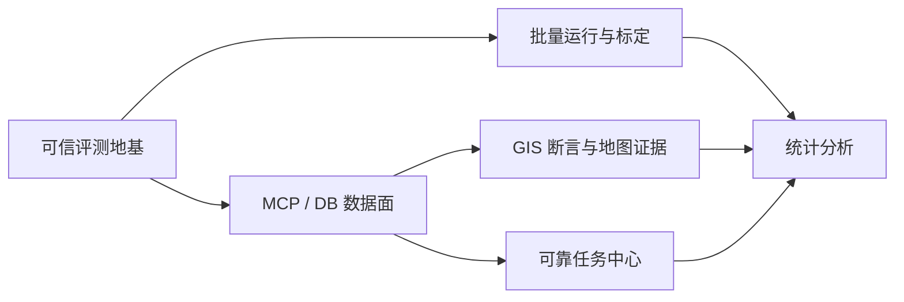

# 未来迭代路线图：可信评测、MCP 数据面与 GIS 差异化

> 状态：**脑暴结论 / 推荐路线（2026-08-27）**，不是已经排期的执行计划。
> 来源：基于当前代码、场景、前端、报告、活设计文档、历史复盘、迭代 5 计划和企划池的全仓分析。
> 用法：本文件负责说明“后续为什么按这个顺序做”；某项正式启动时，再提拔成独立 `迭代N-*.md` 执行计划。
> 当前正式立项为 [迭代5B-MCP全面服务化与DB数据面.md](迭代5B-MCP全面服务化与DB数据面.md)；5A 已完成，见 [迭代5A-可信评测基线.md](迭代5A-可信评测基线.md) 与对应复盘。

---

## 1. 结论先行

GeoSkillBench 当前已经打通：

```text
Scenario
→ Fixture / Ground Truth 隔离
→ MCP 工具发现与调用
→ Skill / External Agent 执行
→ 工具、对话与外部交互记录
→ GIS 结果确定性断言
→ LLM / Rule Judge
→ JSON / Markdown / DB 历史
→ React + SSE 展示
```

它已经不是早期的“假 MCP + 规则判断”MVP，但仍更接近一个**可运行的 GIS Agent 集成评测工作台**，而不是可信、可重复、可规模化的 benchmark 平台。

当前真正的瓶颈不是“功能数量不够”，而是：

1. **平台自身正确性没有自动化证明**：没有项目级测试和 CI，部分通过语义、配置和资源生命周期存在偏差。
2. **一次 run 的身份与产物尚未统一**：DB 按 `run_id` 留历史，JSON/Markdown 按 `scenario_id` 覆盖。
3. **评测科学性未标定**：Orchestrator、模拟用户和 Judge 都可能引入 harness 自身方差。
4. **MCP 控制面已远程化，数据面未远程化**：本地 env、临时文件和同机路径契约仍存在。
5. **GIS 差异化尚未充分产品化**：已有几何数值断言，但缺少空间关系规则、可靠要素匹配和地图证据审阅。

因此，推荐总顺序是：

```text
可信评测地基
  → MCP/DB 协议与纵向闭环
  → 批量重复运行与评测标定
  → GIS 确定性断言与地图证据
  → 可靠任务中心与统计分析
```

核心原则：

> **可信度本身就是评测平台的核心产品功能。**
>
> 如果平台会误判、覆盖证据、混淆基础设施失败与被测系统失败，那么地图、图表和批量运行只会放大不可靠结果。

---

## 2. 五条演进主线

| 主线 | 要解决的问题 | 推荐优先级 |
|---|---|---:|
| A. 评测可信地基 | 平台自己是否会误判、漏判、覆盖或污染运行 | P0 |
| B. MCP/DB 数据面 | 云端 GIS 数据如何引用、产出、比较、归档和清理 | P0 |
| C. 评测科学性 | 单次结果是否稳定，Judge 分数是否可信 | P1 |
| D. GIS 差异化 | 如何提供通用 Agent benchmark 难以替代的领域价值 | P1 |
| E. 产品化控制台 | 如何提高运行管理、结果审阅与回归分析效率 | P2 |

这些主线不是相互独立的功能池，而存在明确依赖：



---

## 3. 推荐路线图

| 阶段 | 名称 | 核心结果 |
|---|---|---|
| 迭代 5A | 可信评测地基与 Run 隔离 | 固定通过语义、自动化安全网、run 级产物、严格生命周期 |
| 迭代 5B | MCP 全面服务化与 DB 数据面 | 网络 MCP + 共享 PostGIS + 安全 handle + 完整归档清理闭环 |
| 迭代 6 | 批量重复运行与评测标定 | batch/repeat/aggregation，量化 harness 方差和 Judge 可信度 |
| 迭代 7 | GIS 确定性评测增强 | 空间关系、几何有效性、CRS、一对一要素匹配、数据 provenance |
| 迭代 8 | GIS 地图证据审阅 | Result / Reference / Diff 可视化与安全 Artifact API |
| 迭代 9 | 可靠 Task Center | 持久任务、恢复、取消、重试、排队、并发控制 |
| 迭代 10 | 统计分析与版本对比 | Scenario/Skill/model/batch 趋势、方差、成本和失败分布 |

说明：

- “5A/5B”是推荐拆分，不改变当前正式计划的编号事实；是否正式改名由启动迭代时决定。
- 5A 不是延迟服务化，而是为破坏性数据面迁移建立可验证安全网。
- 迭代 6 应承接现有 [待定企划-真机标定批次-方差量化与Judge质量.md](待定企划-真机标定批次-方差量化与Judge质量.md)。

---

## 4. 迭代 5A：可信评测地基与 Run 隔离

### 4.1 目标

在大规模修改 MCP 和数据面之前，先证明以下事实：

- 执行失败不会被空断言或 Judge 提升为通过；
- 每个 run 的状态、证据和产物彼此隔离；
- MCP/Executor/临时资源在成功和异常路径都能释放；
- 最危险的行为有自动化回归；
- 报告不泄露 DB URL、Authorization 或密钥；
- 后续迁移失败时可以快速定位是平台、环境还是 SUT 问题。

### 4.2 固定最终通过语义

当前最终状态主要由断言和 Judge 决定，但 `RUN_AGENT`、fatal stage、空回答、轮次耗尽等状态没有形成统一硬门槛。

推荐正式定义：

```text
run_passed =
    execution_status == succeeded
    AND no_fatal_stage_failed
    AND assertion_gate_passed
    AND judge_gate_passed
```

失败分类至少包括：

- `configuration_error`
- `environment_error`
- `execution_failure`
- `assertion_failure`
- `judge_failure`
- `archive_failure`
- `cleanup_failure`

其中：

- 被测 Agent 失败与基础设施失败必须分开统计；
- Judge 调用失败不能伪装成 SUT 失败；
- 报告归档失败不能静默变成“完全成功”；
- 即使继续运行断言和 Judge 以收集诊断，最终 verdict 也必须尊重 fatal stage。

### 4.3 处理无效或模糊配置

`pass_criteria.required_assertions_passed` 当前存在于模型中，但实现始终要求所有断言通过。

短期推荐：

- 删除该字段，明确断言永远是硬门槛；或
- 在不能立即删除时，将其标记 deprecated 并拒绝 `false`，避免产生“已配置但不生效”的假象。

未来确有软指标需求时，再正式设计：

```yaml
assertions:
  - type: result_overlap_ratio
    severity: fatal  # fatal | error | warning
    weight: 1.0
```

不要继续用一个全局布尔值同时承担硬门槛、可选断言和加权评分三种语义。

### 4.4 统一 run 产物模型

当前状态：

```text
DB history:      run_id → 多次运行不覆盖
JSON / Markdown: scenario_id → 同场景重复运行覆盖
outputs:         run_id → 已隔离
```

推荐目录：

```text
reports/runs/<run_id>/
├── result.json
├── report.md
└── outputs/
```

Scenario 仅作为索引维度：

```text
scenario_id → [run_id, run_id, ...]
```

每个 run 至少保存：

- `run_id`、`scenario_id`、可选 `batch_id`；
- Scenario YAML 快照或 hash；
- Skill 主文件和 reference hash；
- fixture/reference 标识、版本、hash；
- Git SHA 和 dirty 状态；
- runtime/executor/model/Judge 配置摘要；
- 各阶段状态与耗时；
- archive/cleanup 状态。

### 4.5 收紧生命周期

推荐约束：

- 每个 run 建立独立 MCP runtime/catalog/dataset registry；
- `finally` 中关闭 Executor session；
- `finally` 中关闭 MCP 连接、子进程和 event loop；
- 清理 Skill ZIP 和 DB pull 临时目录；
- 完整 run 使用 wall-clock deadline；
- 工具调用、LLM 调用和外部 HTTP 请求另有各自 timeout；
- cleanup 幂等，重复调用不报破坏性错误。

### 4.6 建立最低自动化门禁

不要求一次补齐全部测试，先覆盖高风险路径。

#### 单元测试

1. Scenario 类型、范围、未知字段和 executor 兼容性。
2. 最终通过状态和 fatal stage。
3. `required_assertions_passed` 当前行为。
4. 17 类断言的正向、反向和缺参数路径。
5. Judge JSON、多 JSON、非法 score、重试和降级。
6. External-driven `user_enabled=false`。
7. UserSimulator LLM 异常行为。
8. ResultComparator 空数据、CRS、重复/缺失要素。
9. 路径 containment、ZIP/reference 越界。
10. DB URL、Authorization 和报告脱敏。

#### 集成测试

1. MCP server 发现、调用和关闭。
2. HTTP Agent JSON/SSE parser，包括断流和非法帧。
3. `/api/tasks` + SSE。
4. 同一 Scenario 并发两个 run 不覆盖。
5. SQLite 报告写入和历史查询。
6. 异常路径资源无残留。
7. 前端生产构建。

### 4.7 本地确定性基线的定位

正式生产 Scenario 可以按迭代 5 决策删除 `mock/stdio`，但建议保留一个**测试专用网络 MCP fake server**：

- 不作为生产 transport；
- 不进入正式 Scenario 契约；
- 通过和生产相同的网络 MCP client 路径；
- 只用于 CI、contract test 和新开发者验证；
- 提供小型确定性 GIS 数据与失败注入。

这样不违背“生产协议硬切”，也不会失去零外部依赖的回归安全网。

### 4.8 验收标准

- [ ] Agent/fatal stage 失败不可能被 Judge 或空断言提升为 passed。
- [ ] 同一 Scenario 并发两个 run，JSON/Markdown/outputs/DB 均不覆盖。
- [ ] 成功、异常、timeout 三条路径均无残留 MCP 连接和临时目录。
- [ ] 报告不包含明文 DB 密码、API key 和 Authorization。
- [ ] 最低自动化套件可在无真实 LLM、无云端服务时运行。
- [ ] 后端测试、前端 build 成为合并门禁。

---

## 5. 迭代 5B：MCP 全面服务化与 DB 数据面

### 5.1 方向判断

网络 MCP + 共享 PostGIS 的方向成立。当前这些同机假设应被移除：

- fixture 通过环境变量注入本地子进程；
- MCP server 返回本机临时路径；
- client 复制 server 本地文件；
- `db_table` 先拉到客户端临时文件后再注册。

迭代 5 解决的是云端架构的根问题，不是表面重构。

### 5.2 协议必须先冻结

代码修改前至少明确：

1. dataset 标识：物理表名还是不透明 handle；
2. run 注册：认证、幂等、alias 冲突和重试；
3. 隔离：表名前缀还是独立 schema；
4. 权限：平台、MCP server、PostGIS 分别持有什么凭证；
5. 结果回传：字段、版本、错误和 schema；
6. 比对：由平台直接读 DB，还是通过数据服务读取；
7. 归档：谁导出 GeoJSON，失败如何表达；
8. 清理：谁负责释放、TTL 如何兜底；
9. 安全：如何防止任意 handle 读取或删除非 run 数据；
10. 观测：如何关联 run、tool call、结果表与报告。

### 5.3 控制面与 MCP 协议分层

`POST /admin/runs` 不是 MCP 标准协议。建议在设计文档中明确拆成：

```text
MCP protocol:
  tools/list
  tools/call

GeoSkillBench data-control protocol:
  POST /admin/runs
  GET /datasets/{handle}
  POST /datasets/{handle}/export
  DELETE /runs/{run_id}
```

两者的认证、版本、错误码、幂等和重试策略分别定义。

### 5.4 推荐使用受限 handle

不建议让 client 接收任意物理表名后直接查询和 drop。推荐结果结构：

```json
{
  "dataset": {
    "handle": "run_abc:buffer_result",
    "run_id": "abc",
    "alias": "buffer_result",
    "geometry_type": "Polygon",
    "srid": 4326,
    "feature_count": 42
  }
}
```

平台只能对当前 run 注册过的 handle 执行：

- inspect；
- compare；
- export；
- release。

物理表名可作为服务端实现细节，不能成为任意可操作输入。

### 5.5 `id == 表名` 的适用边界

直接让 fixture `id` 等于元数据表名，适合单一受控环境，优点是简单。但它会带来：

- 表重命名导致 Scenario 失效；
- dev/staging/prod 物理命名污染 Scenario；
- 历史报告无法证明同名表是否仍是同一份数据；
- schema 和存储结构进入长期评测契约。

即使暂时不引入逻辑映射层，也至少保存：

```yaml
dataset:
  name: schools
  schema: evaluation_data
  version: "2026-08-25"
  content_hash: "..."
```

长期是否引入稳定逻辑 ID，由多环境部署和数据版本需求决定，不需要在第一版提前过度设计。

### 5.6 清理不能只依赖 client

正常路径可以由 client 触发 export + release，但异常路径还需要：

- server/DB 侧 TTL；
- run 状态表；
- cleanup 幂等；
- 只允许释放当前 run 命名空间；
- client 崩溃后的后台清扫；
- 非法 handle 拒绝；
- export 失败时保留/清理规则；
- cleanup 结果进入报告。

运行状态建议拆分：

```text
execution_status
assertion_status
judge_status
archive_status
cleanup_status
```

“Agent 通过，但 GeoJSON 归档失败”不是 Agent 失败，也不能静默显示为完全成功。

### 5.7 先跑一条纵向闭环

不建议第一步机械迁移全部场景。推荐顺序：

1. 协议文档成文；
2. 建一个最小 DB fixture；
3. 注册 run；
4. 网络 MCP 调用；
5. server 写隔离结果；
6. 返回受限 handle；
7. comparator 读取结果和 reference；
8. `result_*` 通过；
9. 导出 GeoJSON；
10. release/drop；
11. 验证无残留；
12. 并发两个相同 alias 的 run；
13. 注入 server、export、cleanup 故障；
14. 最后批量迁移场景。

### 5.8 验收标准补充

在现有迭代 5 验收标准上建议增加：

- [ ] handle 不能越权访问或释放非当前 run 数据。
- [ ] client 崩溃后，TTL 清理能回收残留结果。
- [ ] export 失败和 cleanup 失败进入独立报告状态。
- [ ] 两个并发 run 使用相同 alias 时互不干扰。
- [ ] fixture/reference 保存版本或内容 hash。
- [ ] 协议 contract test 不依赖真实 LLM。

---

## 6. 迭代 6：批量重复运行与评测标定

### 6.1 为什么优先于地图和完整表单

一次评测可能同时包含四类 LLM：

1. Skill Executor / Orchestrator 模型；
2. 外部被测 Agent 模型；
3. Persona 模拟用户模型；
4. Judge 模型。

单次结果无法区分真实质量与随机波动。没有批量能力，现有方差和 Judge 标定计划只能靠手工反复运行和离线整理报告。

### 6.2 产品模型

```yaml
batch:
  repeat: 5
  concurrency: 2
  continue_on_failure: true
  aggregation: median
```

每个独立 run：

- 拥有自己的 `run_id`；
- 共享一个 `batch_id`；
- 保持独立 session、结果数据和产物；
- 失败不阻止批次继续。

### 6.3 聚合指标

- 通过率；
- Judge 均值、中位数、极差、标准差；
- 断言翻转次数；
- 工具序列一致率；
- 外部交互轮次分布；
- 反问次数和内容差异；
- 平均/最大耗时；
- token 和成本；
- 基础设施失败率；
- SUT 失败率。

### 6.4 标定实验

承接现有待定企划：

#### Harness 方差

- 同一 Orchestrator Scenario 首轮 N=3；
- 波动明显时扩到 N=5~10；
- 规则用户与 LLM persona 分组；
- 比较指令序列、断言集合、Judge score 和反问次数。

#### Judge 质量

- 构建 10~20 个覆盖 pass/fail、Skill/Agent、反问/无反问的样本；
- 人工先盲标，再看 LLM Judge；
- 计算一致率、解析成功率、区分度和阈值混淆矩阵；
- 与人工一致率低于 80% 时，不把 Judge 作为可信硬门槛。

### 6.5 验收标准

- [ ] N 次运行生成 N 个独立 run 产物。
- [ ] 可按 `batch_id` 查询、导出和下钻。
- [ ] 基础设施失败与 SUT 失败分开聚合。
- [ ] 断言翻转和 Judge 波动可直接观察。
- [ ] 形成 Judge 阈值、rubric 和聚合口径的书面结论。
- [ ] 报告保存四类模型各自的版本、随机参数、调用量和成本。

---

## 7. 迭代 7：GIS 确定性评测增强

> 2026-09-02：第一刀已从本脑暴提拔为独立计划 [迭代7-GIS确定性评测增强.md](迭代7-GIS确定性评测增强.md)，范围仅现有 `result_*` 库内比对。下列新断言仍未实现。

### 7.1 原则

优先增加：

- 确定性高；
- 不消耗 LLM；
- 能表达 GIS 业务规则；
- 能提升人工审计证据；
- 通用 Agent benchmark 难以替代的能力。

### 7.2 推荐第一批断言

```yaml
- type: geometry_valid
  target: buffer_result

- type: crs_matches
  target: buffer_result
  value: EPSG:4326

- type: spatial_relation
  target: buffer_result
  relation: contains
  other: schools

- type: no_empty_geometry
  target: buffer_result

- type: result_feature_match
  target: buffer_result
  reference: expected_buffer
  key: school_id
```

### 7.3 改进要素匹配

当前大数据路径使用 result → reference 的 centroid 最近邻，不保证一对一，可能掩盖：

- 重复结果；
- 缺失 reference；
- 拆分/合并异常；
- 属性关联错误。

推荐顺序：

1. 有稳定业务 ID 时优先按 ID join；
2. 无 ID 时使用一对一空间 assignment；
3. 报告 unmatched result/reference 数；
4. 明确每个指标的聚合方式；
5. 将 worst case、median、weighted mean 作为可见证据。

### 7.4 Ground truth provenance

每份 reference 至少记录：

- 输入数据 hash；
- 生成软件和版本；
- 算法与参数；
- 生成时间；
- reference 文件/表 hash；
- 是否与被测工具使用同源实现。

避免生产算法与 oracle 同源时出现“双方共同错误但断言全部通过”。

### 7.5 后续可选能力

- 拓扑错误数；
- 面积守恒；
- 空几何与无效几何比例；
- 边界覆盖；
- 最近邻关系；
- 几何维度和 SRID；
- raster 指标；
- 性能/延迟预算。

---

## 8. 迭代 8：GIS 地图证据审阅

### 8.1 定位

地图不是装饰性 UI，而是评测证据视图。它要帮助人工回答：

- 结果和 reference 差在哪里；
- 数值断言为什么通过或失败；
- 是否存在局部异常、遗漏或重复；
- 展示的是原始数据还是简化/抽样数据。

### 8.2 最小功能

- Result 与 Reference 双图层；
- 图层显隐；
- 自动 zoom 到范围；
- 差异区域高亮；
- 要素属性面板；
- CRS、bbox、要素数；
- 原始数据下载；
- 文件 hash；
- 大数据阈值、简化和抽样说明。

### 8.3 Artifact API

不继续直接暴露服务端文件路径。建议：

```text
GET /api/runs/{run_id}/artifacts
GET /api/runs/{run_id}/artifacts/{artifact_id}
```

Artifact metadata 至少包含：

```json
{
  "artifact_id": "...",
  "role": "result",
  "format": "geojson",
  "size_bytes": 12345,
  "feature_count": 42,
  "crs": "EPSG:4326",
  "sha256": "..."
}
```

访问必须受 run 级权限和路径 containment 约束。

### 8.4 大数据策略

- 设置前端要素数和文件大小上限；
- 由后端提供 bbox、summary、简化或瓦片；
- 明确“仅用于视觉预览”的抽样数据不能替代原始断言证据；
- 报告保留原始 artifact hash。

---

## 9. 迭代 9：可靠 Task Center

### 9.1 当前问题

当前 TaskManager：

- 只存在于单进程内存；
- 服务重启后丢失；
- 多 worker 不共享；
- 没有取消、重试、队列和并发上限；
- 事件列表不裁剪；
- 前端虽维护 `tasks`，但没有形成可恢复的任务中心；
- SSE 出错后主动关闭，不重连或轮询补偿。

### 9.2 推荐能力

- 活跃任务列表；
- 刷新后恢复；
- SSE 断线后状态补偿；
- 取消；
- 重试和“按原配置重跑”；
- 排队和并发上限；
- Task/event TTL；
- task/run/batch 关联；
- 失败阶段和错误分类；
- 最终状态幂等确认。

### 9.3 技术选型原则

如果近期仍是单实例：

- 优先把 Task 状态和事件落 PostgreSQL；
- 不必为了“像生产系统”立即引入 Redis/Celery；
- 先解决恢复、并发和状态一致性；
- 真正出现多实例吞吐需求后再抽象队列 backend。

### 9.4 前端恢复流程

```text
Page load
  → GET /api/tasks
  → discover active tasks
  → GET /api/tasks/{id}
  → subscribe SSE with cursor
  → on disconnect: backoff + status fetch
  → completed: load run detail
```

Task Progress 必须绑定任务自己的 Scenario 类型，而不是当前下拉选择器。

---

## 10. 迭代 10：统计分析与版本对比

### 10.1 启动前提

只有在以下数据语义稳定后再做 Dashboard：

- run/batch 身份统一；
- Judge 已完成标定或明确仅作辅助指标；
- failure taxonomy 稳定；
- model/Skill/Scenario 版本被记录；
- 延迟、token 和成本数据可用。

否则图表只会精确地展示不可信数据。

### 10.2 推荐视图

- 总 run 数、通过率、平均/中位 Judge score；
- Scenario 趋势和不稳定性；
- Skill 版本对比；
- Agent model 对比；
- Judge model 对比；
- 断言类型通过率；
- 工具成功率和延迟；
- 失败原因分布；
- batch 方差和断言翻转；
- token、成本、耗时；
- 基础设施健康与 Judge 降级率。

### 10.3 比较原则

任何跨版本比较必须显示：

- 样本量；
- 数据版本；
- Scenario/Skill hash；
- 模型版本和随机参数；
- 聚合口径；
- 置信区间或至少极差；
- 是否包含基础设施失败。

---

## 11. 暂时不建议优先做的功能

### 11.1 Nanobot 真实 runtime

当前没有真实评测需求驱动。接入会增加新的 runtime 和测试矩阵，但不会解决平台自身可信度问题。

保留占位时，API/UI 必须明确：

```text
runtime_available: false
compatibility_mode: true
```

### 11.2 完整 Scenario 可视化建模器

当前 YAML 原文编辑已提供兜底，而迭代 5 会改变 MCP、fixture 和 result handle 的配置语义。现在投入完整表单很可能重做。

推荐：

- 先修当前表单/API 契约错误；
- 协议稳定后再覆盖复杂配置；
- 长期从统一 capability registry/schema 生成前端选项。

### 11.3 Judge `response_format` 单独立项

可以作为 provider capability 增强，但应先用标定数据确认 JSON 解析失败是否真是主要问题。

推荐形态：

```yaml
capabilities:
  structured_output: true
```

而不是对所有模型无条件发送相同参数。

### 11.4 `forbidden_behavior`

仅在存在必须硬卡的授权、安全或合规红线时提拔。目前与 Judge rubric 重叠，优先级低于 GIS 空间关系断言。

### 11.5 全面替换文本反问协议

不立即删除 `[NEED_INTERACTION]` / `[FINAL]`。推荐渐进方案：

- 内部统一结构化状态；
- 支持结构化输出的 Executor 使用 JSON/tool call；
- 旧文本协议保留为兼容 adapter；
- 报告同时保存原始文本与归一化状态；
- 归一化失败作为显式诊断。

---

## 12. 跨迭代基础能力

这些能力不必单独占一个大迭代，但应随主线逐步补齐。

### 12.1 统一 Registry

目前 Executor、Assertion、Flow、Model provider 的注册方式不一致，API、schema 和前端可能漂移。

长期建议每类能力由 registry 提供：

- key 和 aliases；
- 描述；
- runtime availability；
- 支持的 Scenario 类型；
- capability metadata；
- 配置 schema；
- factory/handler；
- UI label。

### 12.2 可复现性元数据

每个 run 逐步记录：

- Git SHA/dirty；
- Python、OS、GeoPandas、Shapely、PROJ/GDAL 版本；
- Docker image digest；
- 模型实际 ID、provider、temperature、seed；
- Judge prompt/rubric/parser 版本；
- MCP server/协议版本与工具 schema hash；
- token、成本、request ID、retry；
- fixture/reference provenance。

### 12.3 可观测性

- JSON structured logs；
- 所有日志带 run/task/batch/scenario ID；
- stage/tool/LLM/HTTP latency；
- retry/timeout/fallback 指标；
- Judge LLM 成功率和降级原因；
- Prometheus/OpenTelemetry 按实际运维需求后置接入。

### 12.4 安全边界

- API 鉴权和操作权限；
- CORS 明确来源；
- 所有用户路径使用 resolved containment；
- ZIP/reference/symlink 防越界；
- DB identifier 白名单或安全引用；
- report/artifact 统一脱敏；
- MCP 返回路径/handle 不可信；
- Skill/reference/tool description/外部 Agent 输出按不可信内容处理；
- Judge prompt 防止被测输出中的指令注入。

---

## 13. 决策闸门

不要只按时间推进；每阶段满足闸门后再进入下一阶段。

### Gate A：允许启动数据面硬切

- 最终 pass 语义已有测试；
- run 级产物不覆盖；
- MCP contract test 可离线执行；
- 资源释放和敏感信息测试通过。

### Gate B：允许批量迁移全部 Scenario

- 一个最小 DB 场景纵向闭环成功；
- 并发相同 alias 不冲突；
- export/drop/TTL 都有故障测试；
- handle 权限边界通过测试。

### Gate C：允许把 Judge score 当作质量指标

- 完成人工盲标；
- 一致率达到预定义标准；
- 解析和降级率可接受；
- 阈值有混淆矩阵依据；
- 报告保存 Judge 版本和输入证据摘要。

### Gate D：允许建设统计 Dashboard

- run/batch 数据模型稳定；
- failure taxonomy 稳定；
- 版本和成本元数据完整；
- 聚合口径固定并写入报告。

---

## 14. 文档状态一致性待办

当前规划文档存在以下状态漂移，正式启动下一迭代前应统一：

1. `docs/README.md` 曾把 harness 方差量化写成“并入迭代 5”，但当前迭代 5 是 MCP/DB 数据面。
2. `企划池.md` 仍把云端数据面列为“近期不做”，但它已提拔为正式迭代 5。
3. 迭代 5 计划先写“保留一个兼容窗口”，后又记录最终决策为“硬切，无过渡别名”；应明确前者已否决。
4. 企划池中的批量运行和 Judge 增强仍引用旧“迭代 5 标定”编号，应改为引用待定标定企划或未来迭代 6。
5. 报告 identity 应统一以 `run_id` 为准，历史路线图和设计文档中的 `scenario_id` 文件语义需同步更新。

本文件只记录一致性要求，不直接改写历史计划正文；历史文档仍保留其写作时语境。

---

## 15. 下一步建议

如果按本路线推进，最直接的下一项不是继续扩展功能，而是把“迭代 5A”提拔为可执行计划，控制在一个短批次内：

1. 明确 pass/failure taxonomy；
2. 统一 `run_id` 报告目录；
3. 为 P0 行为建立最低测试；
4. 收紧 MCP/Executor 生命周期；
5. 建测试专用网络 MCP fake server；
6. 再冻结 `docs/design/04-MCP服务化数据协议.md`。

这六项完成后，迭代 5 的服务化硬切才具备可验证、可回滚和可定位的实施基础。
