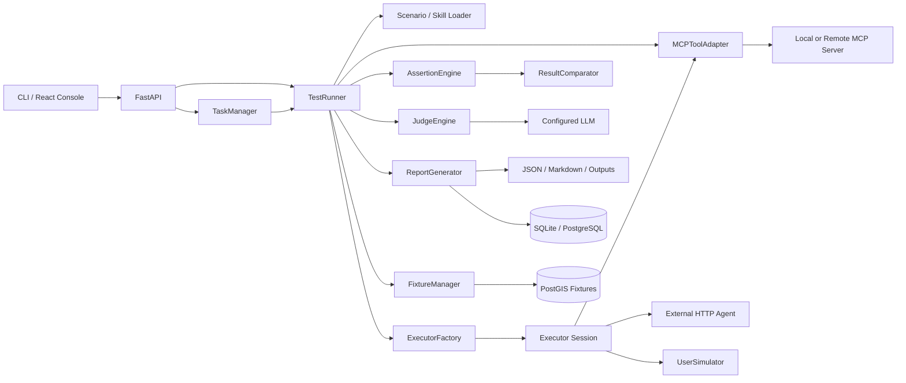
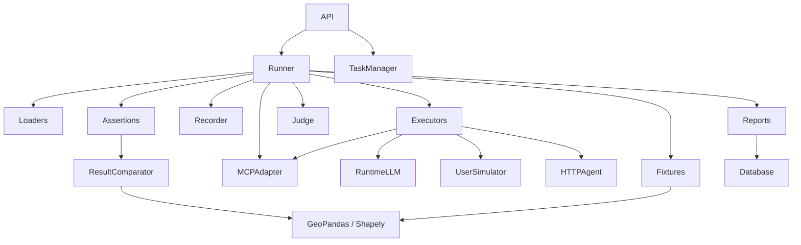
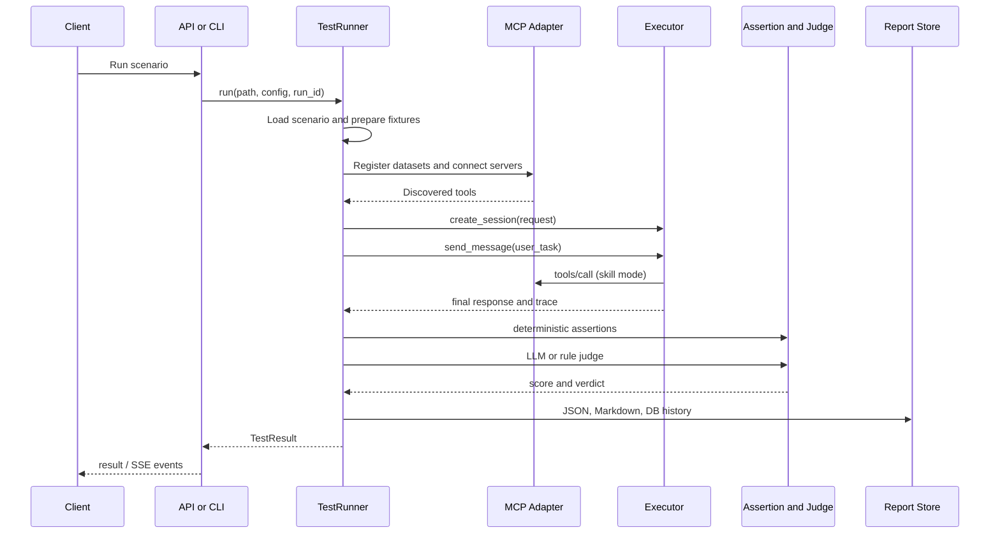
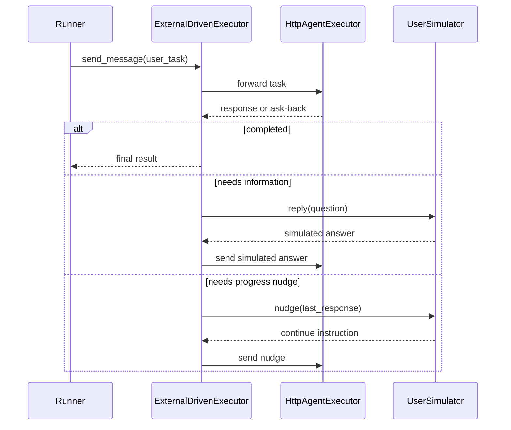
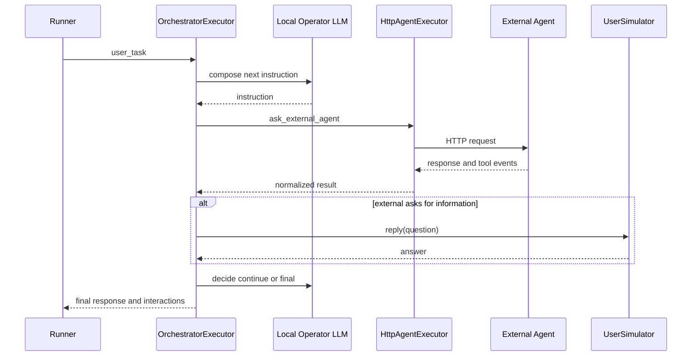

# GeoSkillBench 项目概览

> 本文档由 `project-overview-generator` 以 **Project Mode** 生成。
> 基于 2026-08-27 的本地工作树整理，面向第一次接触本项目、需要理解现状并参与后续迭代的开发者。
> 当前工作树包含尚未提交的规划文档；代码事实优先于历史计划，`docs/design/`、`docs/guide/` 优先于 `docs/plan/` 和 `docs/retrospective/`。

---

## 一、项目是什么

### 一句话定位

**GeoSkillBench** 是一个以 YAML Scenario 驱动的 GIS Agent / Agent Skill 自动化评测平台：它连接 MCP GIS 工具或外部 HTTP Agent，记录完整执行证据，再用确定性断言和 LLM Judge 联合判定质量。

### 核心价值

- **不只检查最终文本**：同时检查 Skill 加载、工具可用性、工具调用顺序、参数、外部交互和最终回答。
- **验证真实 GIS 结果**：使用 GeoPandas/Shapely 对结果与 ground truth 做重叠率、面积误差、Hausdorff 距离、字段和要素数比对。
- **统一多种被测方式**：本地 Skill、外部 HTTP Agent、Orchestrator 多轮指挥、External-driven 反问闭环共用 Executor Session 契约。
- **保留评测证据链**：对话、工具调用、Skill reference 加载、断言、Judge 和阶段状态进入 JSON/Markdown/数据库报告。
- **隔离参考答案**：`data.reference` 不注册给 Agent，只在断言阶段读取，避免 ground truth 泄露。

### 适用场景

- 验证 GIS Skill 是否能稳定驱动 MCP 工具完成空间分析任务。
- 对外部 GIS Agent 做 HTTP/SSE 黑盒验收。
- 比较 Agent 在不同模型、Skill、流程或数据集上的行为与结果。
- 调试多轮反问、Orchestrator 指令链和 LLM Judge。
- 为后续批量回归、方差分析和 GIS 结果审阅提供底座。

### 当前成熟度

当前版本是一个**可用的单次评测开发控制台**，已打通主要执行闭环，但还不是成熟的规模化 benchmark 平台。主要差距是：

- 没有项目自有的自动化测试和 CI 门禁；
- 任务只存在于单进程内存；
- 文件报告仍按 `scenario_id` 覆盖，而 DB 历史按 `run_id` 保存；
- 评测通过语义、资源生命周期和部分配置存在实现偏差；
- LLM Judge、Orchestrator 和模拟用户尚未完成系统标定；
- 批量重复运行、聚合分析、地图审阅尚未产品化。

### 项目状态

- Python 包版本：`0.1.0`（`pyproject.toml`）
- Python：`>=3.11`
- 当前分支：`test-jmx`
- 分析基线提交：`a0a1dec`
- 许可证：仓库未发现明确 `LICENSE` 文件
- 工作树：分析时已有用户侧未提交文档与配置变更，本文未覆盖这些文件

---

## 二、快速开始（Quick Start）

### 前置要求

- Python 3.11+
- Node.js 20+（前端）
- Git Bash（当前 Windows 开发环境）
- 可选：Docker + Docker Compose
- 可选：PostgreSQL/PostGIS
- 真实模型运行时需要 `models.yaml` 和对应 API key 环境变量

### Windows Git Bash 本地运行

当前仓库的部分 shell 脚本使用 Unix 风格 `.venv/bin/activate`，在 Windows Git Bash 下可能失败。更稳定的方式是直接调用虚拟环境解释器：

```bash
# 后端
.venv/Scripts/python.exe -m uvicorn geoskillbench.api.app:app \
  --host 0.0.0.0 --port 8000 --reload

# 前端（另一个终端）
cd frontend
npm run dev
```

如果需要重建依赖，本机 PyPI 必须使用清华镜像：

```bash
python -m venv .venv
.venv/Scripts/python.exe -m pip install -e . \
  -i https://pypi.tuna.tsinghua.edu.cn/simple
```

### CLI

```bash
# 校验场景
.venv/Scripts/python.exe -m geoskillbench.cli validate \
  scenarios/buffer_school_500m_reference_001.yml

# 列出场景可见 MCP 工具
.venv/Scripts/python.exe -m geoskillbench.cli list-tools \
  scenarios/buffer_school_500m_001.yml

# 执行场景（会写 reports/ 和报告数据库）
.venv/Scripts/python.exe -m geoskillbench.cli run \
  scenarios/buffer_school_500m_001.yml --output reports
```

本次生成概览时，以下两个 Scenario 已使用项目虚拟环境成功通过结构校验：

- `scenarios/buffer_school_500m_reference_001.yml`
- `scenarios/agent_orchestrated_actor_multi_turn.yml`

控制台中文在当前 Windows 终端出现乱码，但校验结果本身成功。

### Docker Compose

```bash
# backend + frontend + postgis
docker compose up --build

# 额外启动 mock external agent
docker compose --profile mock up --build
```

默认地址：

- 前端：`http://127.0.0.1:5173`
- API：`http://127.0.0.1:8000`
- OpenAPI：`http://127.0.0.1:8000/docs`
- 健康检查：`http://127.0.0.1:8000/health`

### 启动注意事项

- `docker-compose.yml` 当前显式设置 PostGIS `DATABASE_URL`，并不是自动 SQLite fallback。
- SQLite 默认文件为 `/app/reports.db`，但 Compose 只挂载 `/app/reports`，二者的持久化说明目前不一致。
- `.env`、密钥和真实 `models.yaml` 不应提交到仓库。
- 运行现有场景可能覆盖 `reports/json/<scenario_id>.json` 和 `reports/markdown/<scenario_id>.md`。

---

## 三、核心概念（Core Concepts）

### 1. Scenario

Scenario 是一次评测的声明式配置，定义：

- 被测类型：`agent_skill_test` 或 `agent_test`
- Executor 与模型
- 输入 fixture 和 reference
- MCP server 与工具
- Skill 或外部 Agent
- 用户任务、断言、Judge rubric 和通过阈值

模型位于 `geoskillbench/models/scenario.py`，加载入口位于 `geoskillbench/loader/scenario_loader.py`。

### 2. Skill 与 Skill Package

Skill 是交给本地 Agent 的能力说明，支持：

- `file`：单 YAML Skill
- `package`：目录包
- `package_zip`：ZIP 包

Package 使用 `SKILL.md` 作为初始入口；`references/` 默认不全量注入，Agent 通过 `load_skill_reference` 按需读取。实现位于：

- `geoskillbench/loader/skill_loader.py`
- `geoskillbench/skills/reference_tool.py`
- `skills/gis-vector-analysis/`

### 3. Executor Session

所有执行方式共享三段式契约：

```python
class Executor(ABC):
    @abstractmethod
    def create_session(self, request: ExecutorSessionRequest) -> ExecutorSession:
        raise NotImplementedError

    @abstractmethod
    def send_message(self, session_id: str, message: str) -> ExecutorStepResult:
        raise NotImplementedError

    @abstractmethod
    def close_session(self, session_id: str) -> None:
        raise NotImplementedError
```

当前实现：

| Executor | 定位 | 状态 |
|---|---|---|
| `skill` | 本地 Skill + MCP，真实 LangGraph ReAct 或启发式兼容 | 已实现 |
| `langgraph` | `skill` 的历史别名 | 兼容 |
| `http_agent` | 单次直通外部 HTTP Agent | 已实现 |
| `orchestrator` | 本地 LLM 多轮指挥外部 Agent | 已实现 |
| `external_driven` | 外部 Agent 主导，模拟用户回答反问 | 已实现，真机覆盖不足 |
| `nanobot` | Nanobot 接口兼容占位 | 不是真实 runtime |

### 4. MCP Tool Adapter

`MCPToolAdapter` 是同步 Runner 与异步 MCP SDK 的桥梁：

- 在后台线程运行 asyncio event loop；
- 连接 stdio/mock 或远程 SSE server；
- 通过 `tools/list` 自动发现工具；
- 通过 `tools/call` 调用工具；
- 把结果文件复制到 run 隔离的输出目录；
- 将派生结果注册为 `DatasetContext`。

当前 `transport: http` 仍复用 SSE client，不是真正独立的 Streamable HTTP 实现。

### 5. Fixture 与 Ground Truth

- `data.fixtures`：可被 Agent/MCP 使用的输入数据。
- `data.reference`：只供断言引擎读取的标准答案。

本地文件可由 GeoPandas 读取；`format: db_table` 会从 PostGIS 拉到临时 GeoJSON。该隔离是项目最重要的评测可信边界之一。

### 6. ExecutionRecorder

Recorder 保存：

- Skill 加载；
- Skill reference 加载；
- conversation；
- tool calls；
- external interactions；
- final output；
- errors。

这些证据进入断言、Judge 和报告。

### 7. Assertion Engine

当前实现 17 类确定性断言，覆盖：

- Skill/reference 加载；
- 工具可用、调用、顺序和参数；
- 结果数据集、几何类型、字段和要素数；
- overlap、area error、Hausdorff distance；
- 最终回答文本。

无断言时当前默认 `score=1.0`、`passed=True`，因此最终通过语义必须额外约束执行阶段是否成功。

### 8. Judge

Judge 采用：

1. 真实模型可用时，要求输出结构化 JSON；
2. 解析失败重试一次；
3. 仍失败或模型不可用时，显式降级到规则 Judge；
4. 报告记录 `judge_mode`，不把规则结果伪装成 LLM 结果。

### 9. UserSimulator 与反问闭环

反问循环已下沉到对应 Executor：

- 规则用户从 `user_goal` 提取数据集、距离、格式等答案；
- LLM persona 根据 `user_profile` 和 `user_goal` 回答；
- Skill/Orchestrator 主要使用 `[NEED_INTERACTION]`、`[FINAL]` 文本协议；
- External-driven 使用统一回复分类器。

### 10. Run、Task 与 Report

- `run_id`：一次独立执行的身份。
- Task：API 内存中的异步执行快照和 SSE 事件。
- Report：JSON/Markdown 文件，以及 SQLite/PostgreSQL 中的历史记录。

当前 Task 不持久化；文件报告按 `scenario_id` 覆盖，DB 按 `run_id` 留历史，二者语义尚未统一。

---

## 四、技术栈（Tech Stack）

| 分类 | 选型 | 说明 |
|---|---|---|
| 主语言 | Python 3.11+ | Runner、API、评测和 GIS 数据处理 |
| API | FastAPI + Uvicorn | CRUD、同步运行、异步 Task、SSE |
| 数据模型 | Pydantic v2 | Scenario、执行结果和上下文 |
| Agent | LangChain + LangGraph | ReAct Skill、Orchestrator flow |
| LLM | OpenAI-compatible / LangChain provider | 通过 `models.yaml` 配置；当前无 Anthropic 原生 SDK |
| MCP | MCP Python SDK + FastMCP | 客户端发现/调用与本地 mock server |
| HTTP | HTTPX | 外部 Agent 接入 |
| GIS | GeoPandas + Shapely + PyProj/Pyogrio | fixture、缓冲和结果比对 |
| ORM | SQLAlchemy | SQLite/PostgreSQL 报告历史 |
| 数据库 | SQLite / PostgreSQL / PostGIS | 报告历史；PostGIS fixture/reference |
| 前端 | React 18 + Vite 5 | 单页控制台，无组件库和状态库 |
| Web Server | Nginx | 前端静态资源和 `/api` 同源反代 |
| 容器 | Docker Compose | backend/frontend/postgis/mock-agent |
| 测试 | 尚无项目级测试框架 | 当前依赖 Scenario 手工/集成验证 |

---

## 五、系统架构（Architecture）

### 整体架构图



### 核心模块依赖图



### 单次评测主流程



### External-driven 反问流程



---

## 六、目录结构（Directory Layout）

```text
geo-skill-bench/
├── geoskillbench/              # Python 后端、Runner 与评测引擎
│   ├── api/                    # FastAPI、TaskManager、报告数据库
│   ├── assertions/             # 确定性断言与 GIS 结果比对
│   ├── executors/              # Skill、HTTP、Orchestrator、External-driven
│   ├── fixtures/               # 本地文件和 PostGIS fixture
│   ├── loader/                 # Scenario 与 Skill/Package 加载
│   ├── mcp/                    # MCP client adapter 与本地 mock server
│   ├── models/                 # Scenario、Result、TestContext
│   ├── recorder/               # 执行证据记录
│   ├── reports/                # JSON/Markdown/DB 报告
│   ├── runtime/                # LLM、Judge、UserSimulator、ask-back
│   ├── skills/                 # Skill reference 内部工具
│   ├── cli.py                  # CLI 入口
│   └── runner.py               # 九阶段总编排器
├── frontend/                   # React/Vite 单页控制台
│   └── src/
│       ├── App.jsx             # 任务、SSE、报告、历史主容器
│       ├── ScenarioForm.jsx    # Schema 驱动的新建场景表单
│       ├── ScenarioManager.jsx # YAML 原文 CRUD
│       └── styles.css          # 全局样式
├── scenarios/                  # 可运行 Scenario YAML
├── skills/                     # 单文件 Skill 与 Skill Package
├── fixtures/                   # 输入和参考 GIS 数据
├── examples/                   # mock external agent 与示例配置
├── reports/                    # 报告快照和 run 输出
├── docs/
│   ├── design/                 # 活设计文档
│   ├── guide/                  # 活操作指南
│   ├── plan/                   # 历史/待定计划
│   ├── retrospective/          # 迭代复盘
│   └── reference/              # 参考资料与旧概览
├── scripts/                    # 启动、数据生成、Docker 脚本
├── Dockerfile.backend
├── Dockerfile.frontend
├── docker-compose.yml
├── nginx.conf
└── pyproject.toml
```

### 设计约定

- `docs/design/`、`docs/guide/` 是活文档；`plan/`、`retrospective/` 保留历史语境。
- Scenario 是评测配置的唯一业务入口，代码不应把某个具体场景硬编码进 Runner。
- Ground truth 与 Agent 可见数据分离。
- Executor 自己维护会话和反问闭环，Runner 只负责统一阶段编排。
- 确定性断言优先，LLM Judge 是语义补充，不应替代可确定验证的 GIS 规则。
- 真实模型不可用时必须显式标记降级路径。
- 密钥只通过环境变量注入，不进入 Scenario、Skill 或报告。

---

## 七、核心模块详解（Core Modules）

### 1. `geoskillbench/runner.py` — 九阶段总编排器

**职责**：

- 加载 Scenario；
- 准备输入和 reference；
- 连接 MCP；
- 加载 Skill；
- 创建 Executor Session；
- 收集执行证据；
- 运行断言、Judge、报告和清理；
- 向 API/SSE 发阶段事件。

**核心入口**：

```python
def run(
    self,
    scenario_path: str,
    output_dir: str | None = None,
    event_callback: Callable[[dict[str, Any]], None] | None = None,
    run_config: dict[str, Any] | None = None,
    run_id: str | None = None,
) -> TestResult:
    ...
```

**注意事项**：

- `TestRunner` 长期持有一个 Adapter，目录批量运行可能跨场景积累连接/catalog。
- Executor 和 MCP 关闭尚未完全放入严格 `finally`。
- `runtime.timeout_seconds` 没有成为完整 run 的 wall-clock deadline。
- 最终 `passed` 需要明确纳入 Agent/fatal stage，而不能只依赖断言和 Judge。

### 2. `geoskillbench/models/` — 配置和结果契约

| 文件 | 职责 |
|---|---|
| `scenario.py` | Scenario、runtime、fixture、MCP、Agent、assertion、Judge |
| `result.py` | Session、Step、ToolCall、Assertion、Judge、TestResult |
| `test_context.py` | Agent 可见数据、reference、Skill 和工具上下文 |
| `skill.py` | Skill 和 Skill reference 元数据 |

当前 `AssertionConfig` 是宽模型，不同断言类型的参数组合没有判别联合校验；未知字段也可能被 Pydantic 忽略。对于 benchmark 配置，未来应强化 fail-fast。

### 3. `geoskillbench/mcp/` — MCP 工具接入

**主要文件**：

- `mcp_tool_adapter.py`：连接、发现、调用、结果落盘；
- `mock_gis_server.py`：本地 FastMCP GIS server。

本地 mock server 实际执行 GeoPandas 几何计算，不是简单标签式假实现，暴露：

- `query_dataset_metadata`
- `reproject_dataset`
- `create_buffer`
- `publish_map`

**主要边界**：

- 工具 catalog 当前按 `tool_name` 键控，多 server 同名冲突；
- `http` transport 当前名不副实；
- server 返回本地路径后由 client 复制，隐含同机文件系统信任；
- Server `required` 与 optional 降级语义尚未完整实现。

### 4. `geoskillbench/executors/` — 被测运行时

| 文件 | 职责 |
|---|---|
| `base.py` | Executor 抽象契约 |
| `factory.py` | 名称到实现的工厂 |
| `skill_executor.py` | LangGraph ReAct 和启发式 fallback |
| `heuristic_executor.py` | 确定性缓冲区兼容路径 |
| `http_agent_executor.py` | 外部 HTTP/JSON/SSE Agent |
| `orchestrator_executor.py` | 本地 LLM 指挥外部 Agent |
| `orchestrator_flows.py` | Flow registry 和 scripted graph |
| `external_driven_executor.py` | 外部 Agent 主导反问闭环 |
| `nanobot_executor.py` | Nanobot 兼容占位 |

**扩展方式**：实现 Executor 三方法，并同步工厂、API 能力表和前端 schema。当前注册信息分散，容易漂移，适合演进为统一 registry。

### 5. `geoskillbench/runtime/` — LLM、Judge 与模拟用户

- `llm.py`：从 `models.yaml` 构建模型；
- `llm_judge.py`：Judge prompt、证据压缩和 JSON 解析；
- `judge_runtime.py`：LLM/规则 Judge 路由；
- `user_simulator.py`：规则用户或 LLM persona；
- `askback.py`：反问/完成/继续分类。

当前没有 Anthropic SDK 或 Claude Agent SDK 原生接入；模型主路径是 LangChain + OpenAI-compatible provider。

### 6. `geoskillbench/assertions/` — 确定性评测

`AssertionEngine` 使用 handler map 分发断言。GIS 内容比对由 `ResultComparator` 完成：

- 自动对齐 CRS；
- 距离/面积使用参考数据中心对应 UTM；
- 小数据可整体比较；
- 大于 50 个要素时使用最近邻逐要素比较。

大数据最近邻当前不是一对一 assignment，重复结果可能映射到同一 reference；聚合口径也应进入报告，而不是只存在于实现中。

### 7. `geoskillbench/fixtures/` — 数据准备

`FixtureManager` 支持：

- GeoJSON/JSON/Shapefile/GPKG 本地文件；
- PostGIS `db_table` 拉取；
- reference 隔离；
- 临时拉取目录 cleanup。

当前 `db_url` 可能进入 Dataset metadata，必须在生产化前做脱敏，避免数据库凭据进入报告。

### 8. `geoskillbench/reports/` 与 `geoskillbench/api/db.py`

报告双写：

- `reports/json/<scenario_id>.json`
- `reports/markdown/<scenario_id>.md`
- SQLAlchemy `reports` 表，以 `run_id` 为主键

DB 故障只告警，不使评测失败。优点是主流程可降级，缺点是报告中没有明确 `archive_status`，用户可能不知道 DB 持久化失败。

### 9. `geoskillbench/api/` — Web 控制面

`app.py` 提供：

- Scenario CRUD；
- Skill 查询与文件读取；
- Executor 能力查询；
- validate/list-tools/run；
- Task/SSE；
- 文件报告和 DB Run 历史。

`TaskManager` 使用 `asyncio.to_thread()` 调同步 Runner，事件列表和任务均在内存。它适合单实例 MVP，不适合多 worker、重启恢复或长期队列。

### 10. `frontend/src/` — React 控制台

当前是一个轻量单页控制台：

- Scenario 列表、创建、YAML 编辑、删除；
- Validate、List Tools、Create Task；
- SSE 阶段进度；
- 运行结果详情；
- DB 历史；
- 基础响应式布局。

主要问题：

- `App.jsx` 和 `ScenarioForm.jsx` 体积过大；
- API 请求封装重复；
- 活跃 `tasks` 状态维护但未形成 Task Center；
- SSE 断线不恢复；
- 切换 Scenario 后旧 inspector/result 可能保留；
- 没有地图、聚合图表、下载和对比；
- 没有前端测试、lint、typecheck。

---

## 八、关键业务场景与代码路径（Critical Flows）

### 场景 1：本地 Skill + MCP + GIS 结果断言

**代表配置**：`scenarios/buffer_school_500m_reference_001.yml`

**调用链**：

```text
geoskillbench/cli.py:main
  → geoskillbench/runner.py:TestRunner.run
  → loader/scenario_loader.py:ScenarioLoader.load
  → fixtures/fixture_manager.py:FixtureManager.prepare
  → mcp/mcp_tool_adapter.py:connect_servers
  → loader/skill_loader.py:SkillLoader.load
  → executors/skill_executor.py:create_session/send_message
  → assertions/assertion_engine.py:AssertionEngine.run
  → assertions/result_comparator.py:ResultComparator
  → runtime/judge_runtime.py:JudgeEngine.evaluate
  → reports/report_generator.py:write_reports
```

**业务含义**：验证 Skill 是否能选择正确 GIS 工具、生成可归档数据，并让结果在几何和属性上接近独立 reference。

### 场景 2：Orchestrator 多轮指挥外部 Agent

**代表配置**：`scenarios/agent_orchestrated_actor_multi_turn.yml`



**业务含义**：平台本地 LLM 不是被测外部 Agent，而是测试 harness 的操作员。它发出多轮指令并决定何时完成。因此其自由式推理会引入 harness 方差，需要重复运行和标定。

### 场景 3：External-driven Agent 主导反问

**入口**：`runtime.executor: external_driven`

**调用链**：

```text
Runner
  → ExternalDrivenExecutor.create_session
  → HttpAgentExecutor.create_session
  → ExternalDrivenExecutor.send_message
  → classify_external_reply
  → UserSimulator.reply / nudge
  → HttpAgentExecutor.send_message
  → complete or max_turns
```

**业务含义**：保留被测 Agent 自主推进任务的行为，平台只模拟真实用户回答，不使用本地 Orchestrator 替它规划。

### 场景 4：Skill Package reference 按需加载

**代表包**：`skills/gis-vector-analysis/`

```text
SkillLoader loads SKILL.md and reference index
  → SkillExecutor adds load_skill_reference tool
  → Agent decides a reference is needed
  → safe_resolve_reference validates path
  → file content and SHA-256 returned
  → ExecutionRecorder records load order
  → skill_reference_* assertions verify behavior
```

**业务含义**：避免把整个知识包一次性塞入上下文，同时测试 Agent 是否在正确时机主动读取需要的参考资料。

### 场景 5：异步 Task + SSE + 历史回看

```text
React App
  → POST /api/tasks
  → TaskManager.create_task
  → asyncio.to_thread(TestRunner.run)
  → runner event_callback
  → TaskManager.events
  → GET /api/tasks/{id}/events (SSE)
  → React updates stages/result
  → GET /api/runs and /api/runs/{run_id}
```

**业务含义**：长时间 GIS/LLM 执行不阻塞浏览器交互，用户可实时看到阶段并在 DB 中回看历史。

---

## 九、如何修改、测试和部署

### 新增 Executor

1. 在 `geoskillbench/executors/` 实现 `Executor`。
2. 在 `executors/factory.py` 注册名称。
3. 同步 `/api/executors` 能力描述。
4. 同步 `api/scenario_schema.py` 和前端表单选项。
5. 增加 happy path、缺配置、timeout、异常响应测试。

长期应先建立统一 Executor registry，避免四处同步。

### 新增断言

1. 在 `AssertionConfig` 增加必要参数，或建立独立参数模型。
2. 在 `AssertionEngine._run_single()` 注册 handler。
3. 实现正向、反向、缺参数和边界数据测试。
4. 更新 `api/scenario_schema.py`。
5. 更新 `docs/guide/Scenario配置指南.md`。

GIS 断言优先复用 `ResultComparator` 的 CRS 和几何加载逻辑。

### 新增 Orchestrator flow

使用 `@register_flow(name)` 注册构建函数，并遵守现有 State/Graph 输入输出契约。参考：

- `geoskillbench/executors/orchestrator_flows.py`
- `geoskillbench/executors/example_flows.py`

### 当前验证命令

```bash
# Scenario 结构校验
.venv/Scripts/python.exe -m geoskillbench.cli validate scenarios/<name>.yml

# 前端生产构建
cd frontend && npm run build

# Docker 构建
docker compose build
```

仓库当前没有 pytest/Jest/Vitest/CI。建立可信回归基线时，建议按以下顺序补：

1. Scenario 模型和未知字段/范围校验；
2. 17 类断言；
3. ResultComparator CRS、空数据、重复/缺失要素；
4. MCP 多工具、同名工具、连接关闭；
5. HTTP Agent JSON/SSE parser；
6. External-driven 与 UserSimulator；
7. FastAPI Task/SSE/Run；
8. 同 Scenario 并发报告隔离；
9. SQLite/PostGIS 两条持久化路径；
10. 前端 Task 恢复与关键交互。

### 部署边界

当前 Compose 适合本地和单机验证。生产化前至少需要：

- 鉴权和权限边界；
- 收紧 CORS；
- 路径 containment 校验；
- 报告敏感信息脱敏；
- 持久 Task/队列或明确单 worker 限制；
- 任务取消、并发限制和全局 deadline；
- readiness/dependency health；
- 数据库 migration；
- 结构化日志、run/task correlation ID、指标和追踪。

---

## 十、当前规划、风险与建议阅读顺序

### 已立项的近期方向

当前工作树中的 `docs/plan/迭代5B-MCP全面服务化与DB数据面.md` 计划：

- 删除 `mock/stdio` 正式通道；
- 只保留网络 MCP；
- fixture/reference 只使用共享 PostGIS 表引用；
- MCP server 写 run 隔离结果表；
- tool result 返回 dataset handle；
- 平台导出 GeoJSON 并清理隔离表。

该方向解决控制面已远程化、数据面仍依赖同机文件/env 的结构性矛盾。但在实施前必须冻结以下契约：

- dataset handle 是物理表名还是不透明句柄；
- run 隔离使用表前缀还是独立 schema；
- `POST /admin/runs` 的认证、幂等和失败语义；
- 平台、MCP server、PostGIS 各自持有什么凭证；
- 导出失败、drop 失败、client 崩溃时谁兜底；
- 如何防止非法 handle 删除非 run 表；
- 是否保留仅用于 CI/contract test 的确定性本地 backend。

### 当前最重要的工程风险

1. **通过语义可能失真**：Agent 阶段失败、空断言和 Judge 的组合需要统一硬门槛。
2. **无自动化测试**：破坏性数据面硬切缺少安全网。
3. **run 产物身份不统一**：文件按 scenario 覆盖，DB 按 run 保存。
4. **资源生命周期不严格**：MCP、Executor、临时目录可能跨 run 残留。
5. **任务不可靠**：内存 Task 不支持重启、多 worker 和无限事件控制。
6. **评测未标定**：Orchestrator、persona、Judge 都会引入平台自身方差。
7. **安全边界不足**：路径、DB URL、MCP 返回路径和报告内容需统一治理。

### 新开发者阅读顺序

1. `docs/guide/Scenario配置指南.md`：理解可写什么场景。
2. `geoskillbench/models/scenario.py`：看真实配置契约。
3. `geoskillbench/runner.py`：串起九阶段。
4. `geoskillbench/models/result.py` 与 `test_context.py`：理解执行边界和证据结构。
5. `geoskillbench/executors/base.py`、`factory.py`：理解扩展接口。
6. 根据任务选择：
   - Skill：`skill_executor.py`
   - 外部 Agent：`http_agent_executor.py`
   - 多轮：`orchestrator_executor.py` / `external_driven_executor.py`
7. `mcp/mcp_tool_adapter.py`：理解工具接入。
8. `assertions/`、`runtime/judge_runtime.py`：理解如何判分。
9. `reports/`、`api/`、`frontend/src/App.jsx`：理解控制面和展示。
10. 最后阅读 `docs/design/`，并用代码核对其中仍保留的历史设计段落。

---

## 附录

### 术语表

| 术语 | 含义 |
|---|---|
| Scenario | 一次评测的声明式配置 |
| SUT | System Under Test，被测 Skill 或 Agent |
| MCP | Model Context Protocol，工具发现与调用协议 |
| Fixture | Agent 可见的输入数据 |
| Reference / Ground Truth | 只供断言使用的标准答案 |
| Executor | 对不同 Agent runtime 的统一会话适配 |
| Orchestrator | 本地 LLM 操作员，多轮指挥外部 Agent |
| External-driven | 外部 Agent 自主推进，平台只模拟用户 |
| Assertion | 确定性硬检查 |
| Judge | 语义质量评分；LLM 优先、规则显式降级 |
| Run | 一次独立执行，以 `run_id` 标识 |
| Task | API 内存中的异步运行状态与事件 |
| Artifact | JSON、Markdown、GeoJSON 等运行产物 |

### 文档自动生成说明

- 生成时间：2026-08-27
- 生成工具：`project-overview-generator`（Project Mode）
- 代码来源：本地路径 `D:\program\Git\supermap\geo-skill-bench`
- 分析基线：`test-jmx` @ `a0a1dec`，含工作树未提交规划
- 扫描范围：后端、前端、Scenario、Skill、fixture、报告、脚本、Docker、活文档和历史规划
- 核心模块：10 组
- 关键流程：5 条
- 同类项目对比：未生成；仓库未发现许可证文件，且本次未获得可靠可引用的外部来源
- 后续路线：见 [`docs/plan/未来迭代路线图-可信评测与GIS差异化.md`](docs/plan/未来迭代路线图-可信评测与GIS差异化.md)
- 验证：两个代表性 Scenario 已通过项目虚拟环境的 `validate`；未执行会写报告的真实 run
